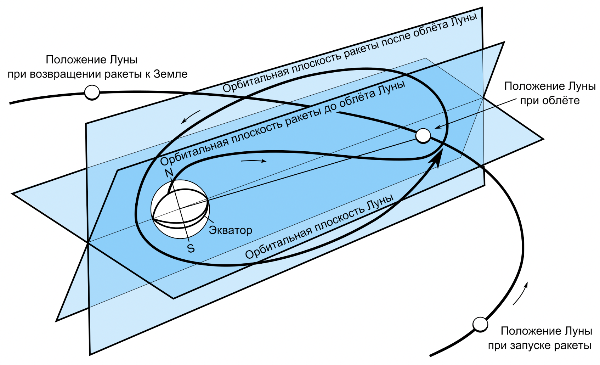
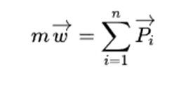
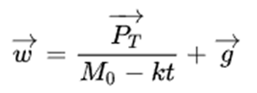
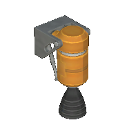
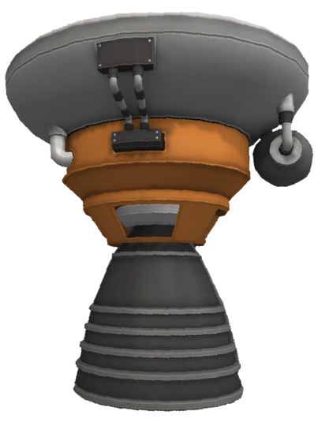

**МИНИСТЕРСТВО НАУКИ И ВЫСШЕГО ОБРАЗОВАНИЯ РОССИЙСКОЙ ФЕДЕРАЦИИ**


**ФЕДЕРАЛЬНОЕ ГОСУДАРСТВЕННОЕ БЮДЖЕТНОЕ ОБРАЗОВАТЕЛЬНОЕ УЧРЕЖДЕНИЕ ВЫСШЕГО ОБРАЗОВАНИЯ «МОСКОВСКИЙ АВИАЦИОННЫЙ ИНСТИТУТ (национальный исследовательский университет)»**

**Зачетная работа по теме "Получение снимков обратной стороны луны"**

|**Участник**|**Роль**|
| :-: | :-: |
|Иванов А.К|Копирайтер|
|Горюнов Д.В|Тимлид, KSP|
|Караев Т.Ж|Программист|
|Кудрявов Л.В|Математик|

**Москва 2022**

***Группа:*** М8О-108Б-22


## Введение

***Цель***:

В KSP отправить космический аппарат к спутнику Земли, собрать данные о небесном теле, используя приборы, которые доступны в игре, и сравнить полученную информацию со знаниями полученными в ходе реальной миссии.

***Задачи реальной миссии:***

Получение фотографий  обратной стороны Луны, а также космического пространства вблизи луны.

***Задачи проекта:***

1. Смоделировать полет космического аппарата “Копатыч” в KSP
1. Произвести необходимые математические расчеты и вывести математические формулы и представить выкладки о полете
1. Составить отчёт о проделанной работе 
1. Грамотно представить проект зрителю 


## Глава 1. Описание реальной миссии

***Цель миссии***

Основной целью космической миссии являлась передача снимков обратной стороны Луны на Землю.


***Описание миссии***

Космический аппарат был запущен 4 октября 1959 года ракетой-носителем «Восток-Л» и впервые в мире сфотографировал невидимую с Земли сторону Луны. Также во время полёта впервые в мире был на практике осуществлён гравитационный манёвр.

4 октября 1959 года к Луне устремилась автоматическая межпланетная станция «Луна-3». Впервые в истории аппарату предстояло обогнуть спутник Земли, сфотографировать его обратную, никем невидимую до сих пор сторону, и передать снимки на Землю. Комплекс телевизионной аппаратуры включал в себя: бортовое фототелевизионное устройство "Енисей", работающее в двух режимах и два типа наземной приемной аппаратуры. 

Историческая съёмка была выполнена 7 октября. С тех пор эта дата – день рождения космического телевидения. Передача первых снимков на Землю осуществлялась 18 октября с расстоянии 40 тысяч км при возвращении станции «Луна-3» в район Земли.

Удалось сфотографировать почти половину поверхности Луны, охватившей 30% видимой стороны и 70% стороны никогда ранее невидимой с Земли. На основе изображений в 1960 и 1967 гг. выпущен Атлас обратной стороны Луны, некоторым образованиям присвоены наименования. Так на Луне появились Море Москвы, Море Мечты, кратеры Циолковский, Ломоносов, Жюль Верн, Джордано Бруно и многие другие. В 1966 –1967 гг. в нашей стране по материалам атласа и карты обратной стороны Луны опубликована первая полная карта Луны и создан лунный глобус.

Связь со станцией поддерживалась до 18 октября 1959 г., она совершила 11 оборотов вокруг Земли и 20 апреля 1960 г. прекратила существование, войдя в ее плотные слои атмосферы. **[^1]**


***Устройство аппарата***

Космический аппарат был запущен ракетой-носителем «Восток-Л» и впервые в мире сфотографировал невидимую с Земли сторону Луны. Также во время полёта впервые в мире был на практике осуществлён гравитационный манёвр.

Конечная масса последней ступени ракеты-носителя с «Луной-3» составляла 1553 кг (масса научной и измерительной аппаратуры с источниками питания 435 кг).

Масса аппарата «Луна-3»: 278,5 кг. 

Космический аппарат имел системы: радиотехнической, телеметрической, фототелеметрической ориентации (относительно Солнца и Луны), энергопитания (с солнечными батареями), терморегулирования и комплекс научной аппаратуры, включая фотолабораторию.

Система ориентации аппарата «Чайка» была разработана и построена коллективом под руководством Бориса Раушенбаха, впервые в мире решившему задачу управления аппаратами в космическом пространстве. **[^2]**

Устройство станции “Луна-3”


***Схема полета***

После старта с космодрома Байконур космический аппарат «Луна-3» вышел на сильно вытянутую эллиптическую орбиту искусственного спутника Земли с наклонением 75° и периодом обращения 22 300 мин и обогнул обратную сторону Луны по направлению с юга на север, пройдя на расстоянии 6200 км от её поверхности. Под действием гравитации Луны орбита аппарата изменилась; кроме того, поскольку Луна продолжала двигаться по своей орбите, изменилась и плоскость орбиты космического аппарата. Изменение орбиты было рассчитано так, чтобы аппарат при возвращении к Земле снова пролетел над Северным полушарием, где были расположены советские наблюдательные станции. Траектория полёта была рассчитана под руководством М. В. Келдыша в Математическом институте им. В. А. Стеклова **[^1]**

Траектория Луны-3 и гравитационный маневр




## Глава 2.  Описание математической и физической моделей

***Математическая модель***

Угол наклона будем считать от вертикали, то есть вертикальному положению ракеты будет соответствовать 0 градусов, горизонтальному - 90 градусов. За основу расчётов будет использована динамика свободной материальной точки и будет решаться вторая задача динамики, то есть, по известным массе точки и силам, действующим на неё, будут вычислены законы её движения. Основное уравнение динамики:



где m- масса точки,- вектор ускорения, - векторы приложенных к точке сил. С учётом действующих на ракету сил уравнение примет вид:


где -суммарная тяга двигателей, - сила тяжести. Ускорение свободного падения принято постоянным, равным поверхности Земли, тогда


И уравнение примет вид:


Разделим обе части уравнения на m:


Космическая ракета - это тело переменной массы, топливо сгорает, масса ракеты уменьшается. Будем называть расход топлива расходом массы. Поэтому m в знаменателе первого слагаемого правой части будет представляться некоторой линейной (так как расход топлива принят постоянным) функцией зависимости массы от времени m=f(t). Обозначим начальную массу ракеты , массу ракеты после выработки топлива M. Тогда  есть масса топлива. Обозначим время работы двигателей T. Тогда


есть расход массы в единицу времени и уравнение расхода массы примет вид:


Подставим это уравнение в уравнение динамики:



Как было сказано выше, тяга двигателя зависит от внешнего давления, это актуально для двигателей первой и второй ступеней до отделения первой ступени, пока ракета летит в плотных слоях атмосферы. Поэтому числитель первого слагаемого правой части уравнения тоже должен быть представлен в виде линейной функции (выше оговаривалось, что за неимением реального закона изменения тяги в зависимости от давления будет использована линейная зависимость). - тяга на старте, - тяга в вакууме, T - время работы двигателей до отделения первой ступени. Тогда коэффициент возрастания тяги будет


Уравнение тяги


Для каждого этапа полёта это уравнение будет считаться отдельно. P1- суммарная тяга двигателей первой и второй ступеней на старте, M1- стартовая масса ракеты, P2- тяга двигателя второй ступени, M2- масса ракеты в момент после отделения первой ступени, P3- тяга двигателя третьей ступени, M3- масса ракеты в момент после отделения второй ступени. Теперь распишем эти уравнения по осям координат, заранее задав линейный закон изменения угла наклона ракеты.


Для первого этапа полёта:


Для второго и третьего этапов полёта:


Теперь заменим в этих уравнениях все ускорения на вторую производную от перемещения:

Мы получили шесть дифференциальных уравнений, которые будем решать численным методом с начальными условиями с помощью программы. Начальные условия для первых двух уравнений принимаются нулевыми (начальные координаты и скорость равны 0). Начальные условия для остальных уравнений берутся из конечных значений решений предыдущих уравнений соответственно

***Физическая модель***

Сила сопротивления направлена против скорости движения, её величина пропорциональна характерной площади S, плотности среды ρ и квадрату скорости V:


Мы учитываем силу сопротивления воздуха до выхода за пределы атмосферы земли, так как во время полёта она создаёт трение между обшивкой ракетоносителя и воздухом, и из-за этого может повредиться корпус аппарата.

Сила трения:


Мы учитываем эту силу, так как она является одним из факторов препятствующих полёту и может повредить обшивку.

Сила притяжения земли:


Мы учитываем силу притяжения земли, так как она является одним из основных критериев для определения количества топлива для полёта и является главным препятствием для взлёта ракеты.

Импульс и закон сохранения импульса:


Мы учитываем их, так как после выхода в космос и набора максимальной скорости, наш аппарат будет двигаться в невесомости по закону сохранения импульса.

Реактивная тяга, уравнение Мещерского:


Мы используем именно это уравнение, так как на нашу ракету действуют другие силы.

Движение по орбите, уравнение Кеплера, движение по параболической орбите:


Мы используем эту формулу для выхода на орбиту луны и движения по ней. 

## Глава 3. Сравнение результатов нашей миссии с полученными в ходе реальной миссии "Луна-3"
Сначала представлены данные из реальной миссии, а затем из смоделированной нами

| |Первая ступень|Вторая ступень|Третья ступень|Первая ступень|Вторая ступень|Третья ступень|
| :-: | :-: | :-: | :-: | :-: | :-: | :-: |
|Масса, т|489.5|179,3|50,062|276|188|81,6|
|Топливо, т|428.3|157,3|43,062|196,4|159,9|56,6|
|Время, с|7281|12670,86|14430|93|130|78|
|Скорость, км/с|474,4|241,3|24,5|142,5|255,71|333,6|
|Импульс, кг\*м/с|546163,5|59383,93|767,83|77691|68837,132|272216,76|
|Ускорение, км/с^2|6,34|1,14|0,1|1,5|1,967|4,3|
|Перегрузка|1,7|1.1|1.01|1,15|1,2|1,4|

Главными причинами различий являются отношение стартовой и конечной массы. Это влияет в первую очередь на импульс ракеты, ведь он зависит от массы и скорости, которая в свою очередь так же зависит от массы. Далее мы можем заметить, что в реальной миссии ускорение и перегрузка постепенно уменьшались, а в нашей наоборот - увеличивались. Это связано с тем, что в миссии “Луна 3” все силы были брошены на первичное ускорение аппарата, а затем он достигал луны за счет гравитационного манёвра, а в миссии “Копатыч” ускорение ракете давалось до тех пор, пока её апоцентр не зайдет за орбиту Луны (это случалось как раз, во время работы 3 ступени). Вследствие этого и время работы двигателей уменьшилось по сравнению с миссией 1959 года, ведь для достижения максимального апоцентра нужно было использовать максимальную мощность двигателей.

## Глава 4. Моделирование в "Kerbal space program"

Для моделирования полета была выбрана компьютерная игра “Kerbal space program”. В ней можно собрать свою ракету и провести собственную миссию с её помощью.
Мы собрали ракету подобную “Протон-М”, но с небольшими отличиями от оригинала (вследствие игровых условностей и возможностей) 
В нашей ракете 3 основные ступени, на каждой из них задействован свой двигатель: 

1 ступень - ***РД RE-M3 “Грохот”***


Этот двигатель создатели игры описывают как: *“Монстр среди двигателей с целью создания большой подъемной силы, мощность ЖРД "Грот" конкурирует даже с целыми небольшими народами”*
От себя добавим, что это один из самых тяжелых и самых мощных двигателей большого размера среди шаблонов деталей. Он обычно используется для создания тяги в больших ракетах и первых ступенях. Он обеспечивается топливом из баков для жидкого топлива большого диаметра.

***2 ступень - “Rockomax 24-77”***



*Детский двигатель! Но очень полезный, хорош для летательных аппаратов, где не подходят более крупные звездообразные двигатели. Хотя, Вам, возможно, понадобится двигатель больше него, чтобы поднимать большие полезные нагрузки.*
Двигатель использовался для создания тяги в ракете. Он был выбран для второй ступени нашего аппарата так как имеет отличное соотношение тяги к весу.

***Ну и 3 ступень - ЖРД  “Шкипер”***



*Меньший родной брат ЖРД "Грохот", конкурент по мощности ЖРД "Шкипер", так что... большие города. Сочетающий большую тягу с разумной эффективностью, этот двигатель превосходен, если используется в качестве ускорителя на средней ступени.*
Обычно используется для создания тяги ракет среднего размера и средних ступеней. Он запитывается от баков жидкого топлива большого диаметра.


## Глава 5. Программная реализация

Для реализации полета в Kerbal Space Program была разработана инструкция для автопилота:

1) включить тягу и лететь вертикально вверх, постепенно отбрасывая ступени;
1) если апоцентр аппарата достиг отметки в 12.5 млн км, выключить тягу и лететь по инерции;
1) если высота аппарата относительно Земли достигла значения в 12 млн км, совершить оборот на 100 градусов относительно горизонта Земли и включить тягу;
1) если апоцентр аппарата достиг отметки в 45 млн км, выключить тягу.

Далее её программное воплощение в kos [^3]:

```
CLEARSCREEN.

LOCK THROTTLE TO 1.0.

WHEN MAXTHRUST = 0 THEN {
	PRINT "Staging".
	STAGE.
	PRESERVE.
}.

WHEN MAXTHRUST = 0 THEN {
	PRINT "Staging".
	STAGE.
	PRESERVE.
}.

WHEN MAXTHRUST = 0 THEN {
	PRINT "Staging".
	STAGE.
	PRESERVE.
}.

LOCK STEERING TO HEADING(90, 90). 

WHEN SHIP:APOAPSIS > 12500000 THEN {
	LOCK THROTTLE TO 0.0.
	WAIT UNTIL SHIP:ALTITUDE > 12000000.
	LOCK STEERING TO HEADING(90, -10).
	WAIT 5.
	LOCK THROTTLE TO 1.0.
	WAIT UNTIL APOAPSIS > 45000000.
	LOCK THROTTLE TO 0.0.
	PRESERVE.	
}.

WAIT UNTIL SHIP:ALTITUDE > 1000000000.
```

Также для визуализации явления гравитационного маневра была разработана программа на языке Python с использованием библиотеки PyGame. Программа рисует на дисплее объекты в виде окружностей. Она просчитывает взаимное притяжение объектов при помощи законов Ньютона, а затем меняет их координаты.

```py:/PyGame-simulation/simulation.py
import pygame, math
from pygame import *
from math import *

WIN_WIDTH = 800
WIN_HEIGHT = 640
PLANET_WIDTH = 20
PLANET_HEIGHT = 20
DISPLAY = (WIN_WIDTH, WIN_HEIGHT)
SPACE_COLOR = "#000022"
SUN_COLOR = "yellow"
PLANET_COLOR = "blue"

X0 = WIN_WIDTH // 2
Y0 = WIN_HEIGHT // 2
M0 = 5000
CRASH_DIST = 10
OUT_DIST = 1000

def main():
    pygame.init()
    screen = pygame.display.set_mode(DISPLAY)
    
    bg = Surface((WIN_WIDTH,WIN_HEIGHT))
    bg.fill(Color(SPACE_COLOR))
    draw.circle (bg, Color(SUN_COLOR), (X0, Y0), 10)
                                    
    timer = pygame.time.Clock()
    
    planet = Surface((PLANET_WIDTH, PLANET_HEIGHT))
    planet.fill(Color(SPACE_COLOR))
    draw.circle (planet,
        Color(PLANET_COLOR),
        (PLANET_WIDTH // 2, PLANET_HEIGHT // 2), 5)

    r = 0.0
    x = 100.0
    y = 290.0
    vx = 0.1
    vy = 1.5
    ax = 0.0
    ay = 0.0

    done = False
    while not done:
        timer.tick(25)
        for e in pygame.event.get():
            if e.type == QUIT:
                done = True
                break

        r = sqrt((x - X0)**2 + (y - Y0)**2)
        
        ax = M0 * (X0 - x) / r**3
        ay = M0 * (Y0 - y) / r**3

        vx += ax
        vy += ay

        x += vx
        y += vy

        screen.blit(bg, (0, 0))
        screen.blit(planet, (int(x), int(y)))
        pygame.display.update()

        if r < CRASH_DIST:
            done = True
            print("Crashed")
            break
        if r > OUT_DIST:
            done = True
            print("Out of system")
            break

if name == "main": main()
```

## Данные и графики 
В ходе полёта были получены некоторые данные. Они были получены с помощью расширения для KSP под названием "Data-export" [^4]

Далее графики некоторых характеристик:

- ось X - время;
- ось Y - соответствующие величины;
- значения даны в системе СИ.

**Скорость**

## 

Обратим внимание на пики графика - это следствие сброса ступеней. Также заметим, что к концу оси X график начинает убывать, т. к. к этому моменту выключается тяга.

Заметим, что уровень тяги меняется трижды вследствие сброса ступеней. Также характер ускорения меняется в зависимости от текущей ступени.
## 

Высота над поверхностью
## 
Изменение скорости относительно ступеней аппарата
##  
## Глава 6. Вывод

В ходе курсовой работы нашей командой были получены фотографии обратной стороны луны в Kerbal Space Program. Были составлены математическая и физическая модели расчетов, необходимых для полёта и был выполнен запуск ракеты-носителя Протон-М в KSP. Также мы составили автопилот для данной ракеты при помощи мода kos. Для более удобного ознакомления с материалами нашей работы наша команда записала небольшой видеоролик о проделанной нами деятельности.


## Использованные источники

1. Создаем симулятор солнечной системы // Хабр URL: https://habr.com/ru/post/197754/ (дата обращения: 13.12.2022).
1. kOS: Kerbal Operating System // kOS URL: https://ksp-kos.github.io/KOS/#kos-kerbal-operating-system (дата обращения: 13.12.2022).
1. kna27 / ksp-data-export // Github URL: https://github.com/kna27/ksp-data-export (дата обращения: 13.12.2022).
1. Протон-М, Протон-К // SPACEDOCK.ru URL: https://spacedock.ru/4484-proton-m-proton-k.html (дата обращения: 13.12.2022).
1. KSP - How to get to the moon (aka Mun) - Tutorial for Beginners // YouTube URL: https://www.youtube.com/watch?v=uCBSpUXrezk (дата обращения: 13.12.2022).
1. Протон-М // Wikipedia URL: https://translated.turbopages.org/proxy\_u/en-ru.ru.8a332669-639ae389-3eafdcb8-74722d776562/https/en.wikipedia.org/wiki/Proton-M (дата обращения: 13.12.2022).Протон-М // Wikipedia URL: https://translated.turbopages.org/proxy\_u/en-ru.ru.8a332669-639ae389-3eafdcb8-74722d776562/https/en.wikipedia.org/wiki/Proton-M (дата обращения: 13.12.2022).
1. Tutorials // Wiki KSP URL: https://wiki.kerbalspaceprogram.com/wiki/Tutorials (дата обращения: 13.12.2022).
1. Космические скорости // Asteropa URL: https://asteropa.ru/kosmicheskie-skorosti/ (дата обращения: 13.12.2022).
1. Как на самом деле фотографировали обратную сторону Луны // TechInsider URL: https://www.techinsider.ru/technologies/9815-temnaya-storona-luny-pervye-fotografii-nevidimoy-storony-luny/ (дата обращения: 20.12.2022).
1. Богатов Г. Б. Как было получено изображение обратной стороны Луны. - СПб.: Государственное энергетическое издательство, 1961. - 66 с.
1. Т.М. Энеев, Э.Л. Аким. Академик М.В. Келдыш. Механика космического полёта. — Институт прикладной математики им. М. В. Келдыша, 2014. - 43 с.


[^1]: Луна-3 // Википедия URL: https://ru.wikipedia.org/wiki/%D0%9B%D1%83%D0%BD%D0%B0-3 (дата обращения: 17.12.2022).
[^2]: Луна-3 // Википедия URL: https://ru.wikipedia.org/wiki/%D0%9B%D1%83%D0%BD%D0%B0-3 (дата обращения: 17.12.2022).
[^3]: kOS: Kerbal Operating System // kOS URL: https://ksp-kos.github.io/KOS/#kos-kerbal-operating-system (дата обращения: 13.12.2022).
[^4]: kna27 / ksp-data-export // Github URL: https://github.com/kna27/ksp-data-export (дата обращения: 13.12.2022).
