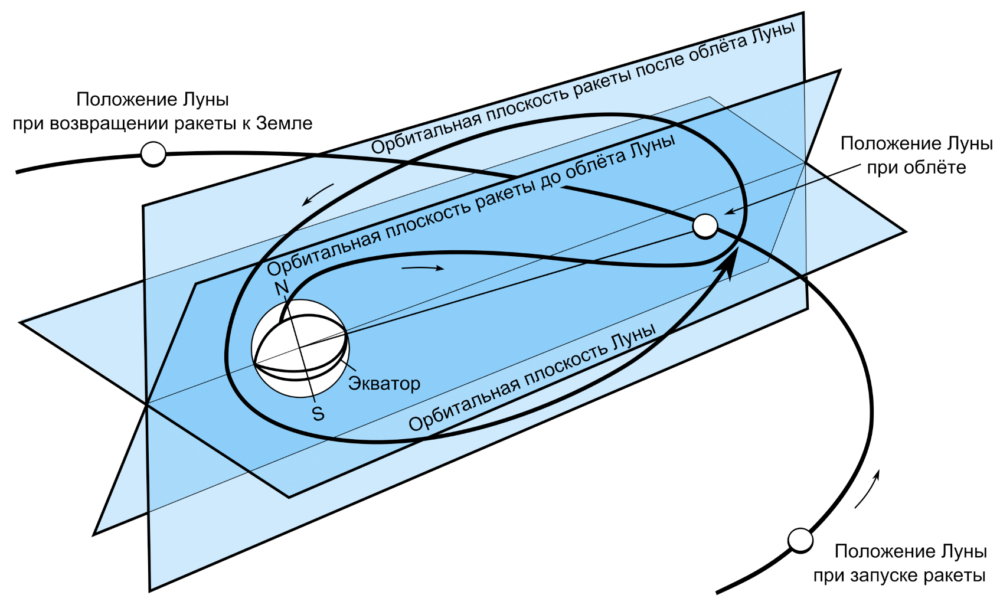

**МИНИСТЕРСТВО НАУКИ И ВЫСШЕГО ОБРАЗОВАНИЯ**

**РОССИЙСКОЙ ФЕДЕРАЦИИ**
**

**ФЕДЕРАЛЬНОЕ ГОСУДАРСТВЕННОЕ БЮДЖЕТНОЕ ОБРАЗОВАТЕЛЬНОЕ**   

` `**УЧРЕЖДЕНИЕ ВЫСШЕГО ОБРАЗОВАНИЯ**

**«МОСКОВСКИЙ АВИАЦИОННЫЙ ИНСТИТУТ**

` 		`**(национальный исследовательский университет)»**
**

**

**

**

**

**Зачетная работа**  

|**На тему:**|**Получение фотографий обратной стороны Луны**|
| :-: | :-: |
** 
**

**

**

**

**

|**Авторы курсовой работы:**|
**Горюнов Д.В.,** 

**Караев Т.Ж., Иванов А.К., Кудрявов Л.В.**
|** |** |
| :-: | - | :-: | :-: |
|** |** |** |** |
|**Преподаватели:**|**Кондратцев В. Л., Тимохин М. Ю.**|** |**                |
|** |** |** |
|||||||||
**   

**Москва 2022**

**Копатыч**

**Команда “Кумаролёт 3000”**

**Группа:** М8О-108Б-22

**Участники:** Горюнов Д.В., Караев Т.Ж., Иванов А.К., Кудрявов Л.В.

**Введение**

**Цель**:

В KSP отправить космический аппарат к спутнику Земли, собрать данные о небесном теле, используя приборы, которые доступны в игре, и сравнить полученную информацию со знаниями полученными в ходе реальной миссии.

**Задачи реальной миссии:**

Получение фотографий  обратной стороны Луны, а также космического пространства вблизи луны.

**Задачи проекта:** 

1. Смоделировать полет космического аппарата “Копатыч” в KSP
1. Произвести необходимые математические расчеты и вывести математические формулы и представить выкладки о полете
1. Составить отчёт о проделанной работе 
1. Грамотно представить проект зрителю 

**Состав команды:**

|**Участник**|**Роль**|
| :-: | :-: |
|Иванов А.К|Копирайтер|
|Горюнов Д.В|Тимлид, KSP|
|Караев Т.Ж|Программист|
|Кудрявов Л.В|Математик|

**Глава 1. Описание реальной миссии.**

**Цель миссии**

Основной целью космической миссии являлась передача снимков обратной стороны Луны на Землю.

**Описание миссии**

Космический аппарат был запущен 4 октября 1959 года ракетой-носителем «Восток-Л» и впервые в мире сфотографировал невидимую с Земли сторону Луны. Также во время полёта впервые в мире был на практике осуществлён гравитационный манёвр.

4 октября 1959 года к Луне устремилась автоматическая межпланетная станция «Луна-3». Впервые в истории аппарату предстояло обогнуть спутник Земли, сфотографировать его обратную, никем невидимую до сих пор сторону, и передать снимки на Землю. Комплекс телевизионной аппаратуры включал в себя: бортовое фототелевизионное устройство "Енисей", работающее в двух режимах и два типа наземной приемной аппаратуры. 

Историческая съёмка была выполнена 7 октября. С тех пор эта дата – день рождения космического телевидения. Передача первых снимков на Землю осуществлялась 18 октября с расстоянии 40 тысяч км при возвращении станции «Луна-3» в район Земли.

Удалось сфотографировать почти половину поверхности Луны, охватившей 30% видимой стороны и 70% стороны никогда ранее невидимой с Земли. На основе изображений в 1960 и 1967 гг. выпущен Атлас обратной стороны Луны, некоторым образованиям присвоены наименования. Так на Луне появились Море Москвы, Море Мечты, кратеры Циолковский, Ломоносов, Жюль Верн, Джордано Бруно и многие другие. В 1966 –1967 гг. в нашей стране по материалам атласа и карты обратной стороны Луны опубликована первая полная карта Луны и создан лунный глобус.

Связь со станцией поддерживалась до 18 октября 1959 г., она совершила 11 оборотов вокруг Земли и 20 апреля 1960 г. прекратила существование, войдя в ее плотные слои атмосферы.[1]

**Устройство аппарата**

Космический аппарат был запущен ракетой-носителем «Восток-Л» и впервые в мире сфотографировал невидимую с Земли сторону Луны. Также во время полёта впервые в мире был на практике осуществлён гравитационный манёвр.

Конечная масса последней ступени ракеты-носителя с «Луной-3» составляла 1553 кг (масса научной и измерительной аппаратуры с источниками питания 435 кг).

Масса аппарата «Луна-3»: 278,5 кг. 

Космический аппарат имел системы: радиотехнической, телеметрической, фототелеметрической ориентации (относительно Солнца и Луны), энергопитания (с солнечными батареями), терморегулирования и комплекс научной аппаратуры, включая фотолабораторию.

Система ориентации аппарата «Чайка» была разработана и построена коллективом под руководством Бориса Раушенбаха, впервые в мире решившему задачу управления аппаратами в космическом пространстве.[1]

Устройство станции “Луна-3”

**[^1]**

**Схема полета**

После старта с космодрома Байконур космический аппарат «Луна-3» вышел на сильно вытянутую эллиптическую орбиту искусственного спутника Земли с наклонением 75° и периодом обращения 22 300 мин и обогнул обратную сторону Луны по направлению с юга на север, пройдя на расстоянии 6200 км от её поверхности. Под действием гравитации Луны орбита аппарата изменилась; кроме того, поскольку Луна продолжала двигаться по своей орбите, изменилась и плоскость орбиты космического аппарата. Изменение орбиты было рассчитано так, чтобы аппарат при возвращении к Земле снова пролетел над Северным полушарием, где были расположены советские наблюдательные станции. Траектория полёта была рассчитана под руководством М. В. Келдыша в Математическом институте им. В. А. Стеклова.[3]

Траектория Луны-3 и гравитационный маневр

[^2]

**Глава 2.  Описание математической и физической моделей**

**Математическая модель**

Угол наклона будем считать от вертикали, то есть вертикальному положению ракеты будет соответствовать 0 градусов, горизонтальному - 90 градусов. За основу расчётов будет использована динамика свободной материальной точки и будет решаться вторая задача динамики, то есть, по известным массе точки и силам, действующим на неё, будут вычислены законы её движения. Основное уравнение динамики:

где m- масса точки,- вектор ускорения, - векторы приложенных к точке сил. С учётом действующих на ракету сил уравнение примет вид:

где -суммарная тяга двигателей, - сила тяжести. Ускорение свободного падения принято постоянным, равным поверхности Земли, тогда

И уравнение примет вид:

Разделим обе части уравнения на m:

Космическая ракета - это тело переменной массы, топливо сгорает, масса ракеты уменьшается. Будем называть расход топлива расходом массы. Поэтому m в знаменателе первого слагаемого правой части будет представляться некоторой линейной (так как расход топлива принят постоянным) функцией зависимости массы от времени m=f(t). Обозначим начальную массу ракеты , массу ракеты после выработки топлива M. Тогда  есть масса топлива. Обозначим время работы двигателей T. Тогда

` `

есть расход массы в единицу времени и уравнение расхода массы примет вид:

Подставим это уравнение в уравнение динамики:

Как было сказано выше, тяга двигателя зависит от внешнего давления, это актуально для двигателей первой и второй ступеней до отделения первой ступени, пока ракета летит в плотных слоях атмосферы. Поэтому числитель первого слагаемого правой части уравнения тоже должен быть представлен в виде линейной функции (выше оговаривалось, что за неимением реального закона изменения тяги в зависимости от давления будет использована линейная зависимость). - тяга на старте, - тяга в вакууме, T - время работы двигателей до отделения первой ступени. Тогда коэффициент возрастания тяги будет

Уравнение тяги

Для каждого этапа полёта это уравнение будет считаться отдельно. P1- суммарная тяга двигателей первой и второй ступеней на старте, M1- стартовая масса ракеты, P2- тяга двигателя второй ступени, M2- масса ракеты в момент после отделения первой ступени, P3- тяга двигателя третьей ступени, M3- масса ракеты в момент после отделения второй ступени. Теперь распишем эти уравнения по осям координат, заранее задав линейный закон изменения угла наклона ракеты.

Для первого этапа полёта:

Для второго и третьего этапов полёта:

Теперь заменим в этих уравнениях все ускорения на вторую производную от перемещения:

Мы получили шесть дифференциальных уравнений, которые будем решать численным методом с начальными условиями с помощью программы. Начальные условия для первых двух уравнений принимаются нулевыми (начальные координаты и скорость равны 0). Начальные условия для остальных уравнений берутся из конечных значений решений предыдущих уравнений соответственно

**Физическая модель**

Сила сопротивления направлена против скорости движения, её величина пропорциональна характерной площади S, плотности среды ρ и квадрату скорости V:

Мы учитываем силу сопротивления воздуха до выхода за пределы атмосферы земли, так как во время полёта она создаёт трение между обшивкой ракетоносителя и воздухом, и из-за этого может повредиться корпус аппарата.

Сила трения:

Мы учитываем эту силу, так как она является одним из факторов препятствующих полёту и может повредить обшивку.

Сила притяжения земли:

Мы учитываем силу притяжения земли, так как она является одним из основных критериев для определения количества топлива для полёта и является главным препятствием для взлёта ракеты.

Импульс и закон сохранения импульса:

Мы учитываем их, так как после выхода в космос и набора максимальной скорости, наш аппарат будет двигаться в невесомости по закону сохранения импульса.

Реактивная тяга, уравнение Мещерского:

Мы используем именно это уравнение, так как на нашу ракету действуют другие силы.

Движение по орбите, уравнение Кеплера, движение по параболической орбите:

Мы используем эту формулу для выхода на орбиту луны и движения по ней. 

**Глава 3. Результаты полученные из KSP и в ходе математических вычислений. Сравнение с реальной космической миссией.**

| |Первая ступень|Вторая ступень|Третья ступень|
| :-: | :-: | :-: | :-: |
|Масса, т|489.5|179,3|50,062|
|Топливо, т|428.3|157,3|43,062|
|Время, с|7281|12670,86|14430|
|Скорость, км/с|474,4|241,3|24,5|
|Импульс, кг\*м/с|546163,5|59383,93|767,83|
|Ускорение, км/с^2|6,34|1,14|0,1|
|Перегрузка|1,7|1.1|1.01|

**Глава 4. Программная реализация.**

Для реализации полета в Kerbal Space Program[5] была разработана инструкция для автопилота:

1) включить тягу и лететь вертикально вверх, постепенно отбрасывая ступени;
1) если апоцентр аппарата достиг отметки в 12.5 млн км, выключить тягу и лететь по инерции;
1) если высота аппарата относительно Земли достигла значения в 12 млн км, совершить оборот на 100 градусов относительно горизонта Земли и включить тягу;
1) если апоцентр аппарата достиг отметки в 45 млн км, выключить тягу.

Далее её программное воплощение в kos[4]:

|CLEARSCREEN.  LOCK THROTTLE TO 1.0.  WHEN MAXTHRUST = 0 THEN { `	`PRINT "Staging". `	`STAGE. `	`PRESERVE. }.  WHEN MAXTHRUST = 0 THEN { `	`PRINT "Staging". `	`STAGE. `	`PRESERVE. }.  WHEN MAXTHRUST = 0 THEN { `	`PRINT "Staging". `	`STAGE. `	`PRESERVE. }.  LOCK STEERING TO HEADING(90, 90).   WHEN SHIP:APOAPSIS > 12500000 THEN { `	`LOCK THROTTLE TO 0.0. `	`WAIT UNTIL SHIP:ALTITUDE > 12000000. `	`LOCK STEERING TO HEADING(90, -10). `	`WAIT 5. `	`LOCK THROTTLE TO 1.0. `	`WAIT UNTIL APOAPSIS > 45000000. `	`LOCK THROTTLE TO 0.0. `	`PRESERVE.	 }.  WAIT UNTIL SHIP:ALTITUDE > 1000000000.|
| :- |

Также для визуализации явления гравитационного маневра была разработана программа на языке Python с использованием библиотеки PyGame.[4]Программа рисует на дисплее объекты в виде окружностей. Она просчитывает взаимное притяжение объектов при помощи законов Ньютона, а затем меняет их координаты.

|import pygame, math from pygame import \* from math import \*  WIN\_WIDTH = 800 WIN\_HEIGHT = 640 PLANET\_WIDTH = 20 PLANET\_HEIGHT = 20 DISPLAY = (WIN\_WIDTH, WIN\_HEIGHT) SPACE\_COLOR = "#000022" SUN\_COLOR = "yellow" PLANET\_COLOR = "blue"  X0 = WIN\_WIDTH // 2 Y0 = WIN\_HEIGHT // 2 M0 = 5000 CRASH\_DIST = 10 OUT\_DIST = 1000  def main(): `    `pygame.init() `    `screen = pygame.display.set\_mode(DISPLAY)      `    `bg = Surface((WIN\_WIDTH,WIN\_HEIGHT)) `    `bg.fill(Color(SPACE\_COLOR))      `    `draw.circle (bg, Color(SUN\_COLOR), (X0, Y0), 10)                                      `    `timer = pygame.time.Clock()      `    `planet = Surface((PLANET\_WIDTH, PLANET\_HEIGHT)) `    `planet.fill(Color(SPACE\_COLOR)) `    `draw.circle (planet, `        `Color(PLANET\_COLOR), `        `(PLANET\_WIDTH // 2, PLANET\_HEIGHT // 2), 5)  `    `r = 0.0 `    `x = 100.0 `    `y = 290.0 `    `vx = 0.1 `    `vy = 1.5 `    `ax = 0.0 `    `ay = 0.0  `    `done = False `    `while not done: `        `timer.tick(25) `        `for e in pygame.event.get(): `            `if e.type == QUIT: `                `done = True `                `break          `        `r = sqrt((x - X0)\*\*2 + (y - Y0)\*\*2)          `        `ax = M0 \* (X0 - x) / r\*\*3 `        `ay = M0 \* (Y0 - y) / r\*\*3  `        `vx += ax `        `vy += ay  `        `x += vx `        `y += vy  `        `screen.blit(bg, (0, 0))       `        `screen.blit(planet, (int(x), int(y))) `        `pygame.display.update()       `        `if r < CRASH\_DIST: `            `done = True `            `print("Crashed") `            `break `        `if r > OUT\_DIST: `            `done = True `            `print("Out of system") `            `break  if name == "main": main()|
| :- |

##
##
##
##
##
##
##
## [^3]
## **Данные и графики**
В ходе полёта были получены некоторые данные. Со всем объёмом информации вы можете ознакомится по ссылке: 

Далее графики некоторых характеристик:

- ось X - время;
- ось Y - соответствующие величины;
- значения даны в системе СИ.

Скорость

Обратим внимание на пики графика - это следствие сброса ступеней. Также заметим, что к концу оси X график начинает убывать, т. к. к этому моменту выключается тяга.Скорость, ускорение, тяга

Заметим, что уровень тяги меняется трижды вследствие сброса ступеней. Также характер ускорения меняется в зависимости от текущей ступени.

Высота над поверхностью
## 
Изменение скорости относительно ступеней аппарата
## 
##
## **Глава 4.Вывод.**

В ходе курсовой работы нашей командой были получены фотографии обратной стороны луны в Kerbal Space Program. Были составлены математическая и физическая модели расчетов, необходимых для полёта и был выполнен запуск ракеты-носителя Протон-М в KSP. Также мы составили автопилот для данной ракеты при помощи мода kos. Для более удобного ознакомления с материалами нашей работы наша команда записала небольшой видеоролик о проделанной нами деятельности.

**Использованные источники**
**

1. Создаем симулятор солнечной системы // Хабр URL: https://habr.com/ru/post/197754/ (дата обращения: 13.12.2022).
1. ` `kOS: Kerbal Operating System // kOS URL: https://ksp-kos.github.io/KOS/#kos-kerbal-operating-system (дата обращения: 13.12.2022).
1. ` `kna27 / ksp-data-export // Github URL: https://github.com/kna27/ksp-data-export (дата обращения: 13.12.2022).
1. Протон-М, Протон-К // SPACEDOCK.ru URL: https://spacedock.ru/4484-proton-m-proton-k.html (дата обращения: 13.12.2022).
1. KSP - How to get to the moon (aka Mun) - Tutorial for Beginners // YouTube URL: https://www.youtube.com/watch?v=uCBSpUXrezk (дата обращения: 13.12.2022).
1. Протон-М // Wikipedia URL: https://translated.turbopages.org/proxy\_u/en-ru.ru.8a332669-639ae389-3eafdcb8-74722d776562/https/en.wikipedia.org/wiki/Proton-M (дата обращения: 13.12.2022).Протон-М // Wikipedia URL: https://translated.turbopages.org/proxy\_u/en-ru.ru.8a332669-639ae389-3eafdcb8-74722d776562/https/en.wikipedia.org/wiki/Proton-M (дата обращения: 13.12.2022).
1. Tutorials // Wiki KSP URL: https://wiki.kerbalspaceprogram.com/wiki/Tutorials (дата обращения: 13.12.2022).
1. Космические скорости // Asteropa URL: https://asteropa.ru/kosmicheskie-skorosti/ (дата обращения: 13.12.2022).
1. Как на самом деле фотографировали обратную сторону Луны // TechInsider URL: https://www.techinsider.ru/technologies/9815-temnaya-storona-luny-pervye-fotografii-nevidimoy-storony-luny/ (дата обращения: 20.12.2022).
1. Богатов Г. Б. Как было получено изображение обратной стороны Луны. - СПб.: Государственное энергетическое издательство, 1961. - 66 с.
1. ` `Т.М. Энеев, Э.Л. Аким. Академик М.В. Келдыш. Механика космического полёта. — Институт прикладной математики им. М. В. Келдыша, 2014. - 43 с.

[^1]: Луна-3 // Википедия URL: https://ru.wikipedia.org/wiki/%D0%9B%D1%83%D0%BD%D0%B0-3 (дата обращения: 17.12.2022).
[^2]: Луна-3 // Википедия URL: https://ru.wikipedia.org/wiki/%D0%9B%D1%83%D0%BD%D0%B0-3 (дата обращения: 17.12.2022).
[^3]: kOS: Kerbal Operating System // kOS URL: https://ksp-kos.github.io/KOS/#kos-kerbal-operating-system (дата обращения: 13.12.2022).

    kna27 / ksp-data-export // Github URL: https://github.com/kna27/ksp-data-export (дата обращения: 13.12.2022).